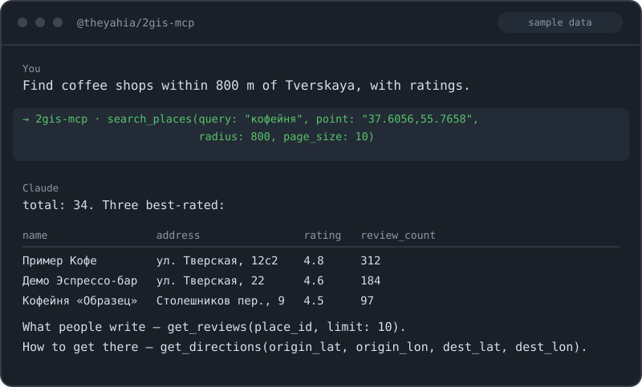

# @theyahia/2gis-mcp

> MCP server for **2GIS** API — places search, geocoding, directions, suggest, reviews. Russia and CIS.
> 8 tools. API key (query-param) auth. Stdio + Streamable HTTP transports.

[](https://www.npmjs.com/package/@theyahia/2gis-mcp)
[](https://opensource.org/licenses/MIT)



---

### Migrating from v1.x

If you used v1.x, the v2.0.0 release adds Streamable HTTP transport and is built on `@theyahia/mcp-core`. Breaking changes:

- **HTTP transport added:** previously stdio-only. v2 enables HTTP via `--http` flag or `HTTP_PORT` env.
- **Server entry refactored:** `src/server.ts` (factory) split out from `src/index.ts` (bin entry) for testability.
- **Native HTTP client kept:** unlike most v2 servers in this monorepo, 2gis spans 4 different base URLs (catalog / routing / suggest / reviews) and uses query-param API key auth. The `BaseHttpClient` + `AuthStrategy` model from `@theyahia/mcp-core` doesn't fit cleanly, so the existing battle-tested HTTP client (`src/client.ts`) is preserved as-is. mcp-core is used here for entry/transport (`runServer`, `createLogger`).

Tool names, arguments, return formats, and `TWOGIS_API_KEY` env var are unchanged.

---

## Tools (8)

### Places

| Tool | Description |
|------|-------------|
| `search_places` | Search places, businesses, and points of interest by query. Optional center point + radius. |
| `get_place` | Get full details for a place by 2GIS ID (address, schedule, phones, photos, reviews). |
| `search_by_rubric` | Search places by rubric (category) ID near a location. |

### Geocoding

| Tool | Description |
|------|-------------|
| `geocode` | Convert an address to coordinates. |
| `reverse_geocode` | Convert coordinates to an address. |

### Directions & Suggest

| Tool | Description |
|------|-------------|
| `get_directions` | Build a route between two points. Modes: driving, walking, public transport. |
| `suggest` | Search-as-you-type suggestions. |

### Reviews

| Tool | Description |
|------|-------------|
| `get_reviews` | Get user reviews for a place. |

---

## Quick Start

### Claude Desktop

Add to `claude_desktop_config.json`:

```json
{
  "mcpServers": {
    "2gis": {
      "command": "npx",
      "args": ["-y", "@theyahia/2gis-mcp"],
      "env": {
        "TWOGIS_API_KEY": "your_2gis_key"
      }
    }
  }
}
```

### Cursor / Windsurf

Same configuration block under `mcpServers` in the IDE's MCP settings.

### VS Code (Copilot)

Add to `.vscode/mcp.json`:

```json
{
  "servers": {
    "2gis": {
      "command": "npx",
      "args": ["-y", "@theyahia/2gis-mcp"],
      "env": { "TWOGIS_API_KEY": "your_2gis_key" }
    }
  }
}
```

### Streamable HTTP transport

```bash
HTTP_PORT=3000 TWOGIS_API_KEY=your_key npx @theyahia/2gis-mcp
```

Endpoints:
- `POST /mcp` — MCP requests
- `GET /mcp` — SSE event stream (per session)
- `DELETE /mcp` — session termination
- `GET /health` — `{ status: "ok", version, tools, uptime, memory_mb }`

---

## Environment Variables

| Variable | Required | Description |
|----------|----------|-------------|
| `TWOGIS_API_KEY` | yes | API key from [dev.2gis.com](https://dev.2gis.com/). |
| `HTTP_PORT` | no | If set, server runs in HTTP mode on this port. |

The API key is sent as a query param (`?key=...`) in every request, never in headers. It is never logged or included in error messages returned to clients.

---

## Authentication

1. Register at [dev.2gis.com](https://dev.2gis.com/).
2. Create an API key with permissions for the categories you need (Catalog, Geocoder, Routing, Reviews).
3. Use the key as `TWOGIS_API_KEY`.

The same key is used for all 4 underlying APIs (catalog, routing, suggest, reviews).

---

## Demo Prompts

Try these natural-language prompts in your MCP client:

> "Find all coffee shops within 1km of point lat=55.7558, lon=37.6173 (Moscow center)."

> "Get directions by car from the Kremlin to Sheremetyevo airport."

> "Geocode the address 'Moscow, Tverskaya 13' and return coordinates."

> "Reverse geocode lat=55.7558, lon=37.6173 — what's the address?"

> "Show me reviews for the place with ID `70000001025437824` (sorted by date)."

> "Suggest places matching 'Стародубова' near point 37.6173,55.7558."

> "Find all pharmacies (rubric 197) within 2km of point 37.6173,55.7558."

---

## Development

```bash
pnpm install
pnpm --filter @theyahia/2gis-mcp build
pnpm --filter @theyahia/2gis-mcp test
pnpm --filter @theyahia/2gis-mcp dev   # tsx watch mode
```

Project layout:

```
servers/2gis/
├── src/
│   ├── index.ts          — bin entry, runServer
│   ├── server.ts         — createServer factory, registers 4 tool groups
│   ├── client.ts         — native HTTP client (4 base URLs, query-param auth)
│   ├── types.ts          — TypeScript types for 2GIS responses
│   ├── lib/
│   │   └── formatters.ts — success/error MCP response helpers
│   └── tools/
│       ├── search.ts        — search_places, get_place, search_by_rubric
│       ├── geocoding.ts     — geocode, reverse_geocode
│       ├── directions.ts    — get_directions, suggest
│       └── reviews.ts       — get_reviews
└── tests/
    ├── client.test.ts
    ├── server.test.ts
    └── tools.test.ts
```

---

## License

MIT — see [LICENSE](./LICENSE).

---

Часть монорепозитория [WWmcp](https://github.com/theYahia/WWmcp) · Telegram: [@vhodvai](https://t.me/vhodvai)
