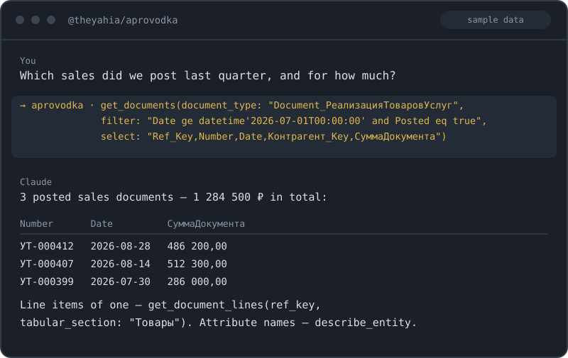

# @theyahia/aprovodka

> ℹ️ **Where the code lives:** this is the canonical source — development, tests and npm releases
> of `@theyahia/aprovodka` all happen here, in the WWmcp monorepo. The standalone repo
> **[theYahia/aprovodka](https://github.com/theYahia/aprovodka)** is the project's landing page
> (it redirects from the former `theYahia/1c-rest-mcp` URL); the tree it still carries is the
> pre-rename 3.2.0 code. Open issues & PRs here.
>
> **Renamed in 4.0.0:** `@theyahia/1c-rest-mcp` → `@theyahia/aprovodka`. The old package is
> deprecated and frozen at 3.2.0. Reason is regulatory, not technical — see [CHANGELOG](./CHANGELOG.md).

> MCP server for **1C:Enterprise** REST API via OData 3.0 — catalogs, documents, registers,
> accounting, constants, reports, batch ops & change-tracking + metadata discovery.
> 34 tools across 11 modules. HTTP Basic auth. Stdio + Streamable HTTP transports.

[](https://www.npmjs.com/package/@theyahia/aprovodka)
[](https://opensource.org/licenses/MIT)



---

### Migrating from @theyahia/1c-rest-mcp (v3.x → v4.0.0)

The package was **renamed to `@theyahia/aprovodka`**. `@theyahia/1c-rest-mcp` is deprecated and frozen at v3.2.0.

- **Install the new package:** `npx -y @theyahia/aprovodka`.
- **Binary renamed:** `1c-rest-mcp` → `aprovodka`. `aprovodka --http` and `HTTP_PORT=3000 aprovodka` work as before.
- **Server name in the MCP handshake** is now `aprovodka` — update the key in your client config if you pinned it.

Everything else is unchanged: all 32 tool names, their arguments and return formats, the 3 prompts, and the `ONEC_*` env vars (plus the `1C_*` backward-compat aliases). Renaming the package does **not** require touching your existing config beyond the command itself.

### Migrating from v1.x

If you starred or used v1.x, the v2.0.0 release introduced a few breaking changes:

- **HTTP transport env var renamed:** `PORT=3000` → `HTTP_PORT=3000`.
- **Removed separate HTTP binary:** `1c-rest-mcp-http` is gone. Use `aprovodka --http` or `HTTP_PORT=3000 aprovodka` instead.
- **Single `bin` entrypoint:** `dist/http.js` is no longer published.
- **Internal client:** now extends `@theyahia/mcp-core`'s `BaseHttpClient` with `BasicAuthStrategy`. The exported functional API (`oneCGet/oneCPost/oneCPatch/buildODataPath`) is unchanged, so tool code keeps working.
- **Tool errors:** now returned as MCP-spec `CallToolResult` with `isError: true` (via `withErrorHandling` from `@theyahia/mcp-core`). Compatible with all MCP clients.

Tool names, arguments, return formats, and the `ONEC_*` env vars are unchanged.

---

## Tools (34)

> Tools are grouped into modules. All are registered by default; the `ONEC_SERVICES`
> env var filters which optional modules load (discovery `meta` is always on). See
> [Environment Variables](#environment-variables).

### Discovery — `meta` (always enabled)

| Tool | Description |
|------|-------------|
| `list_entities` | List all available 1C OData entities. `type` filters by group: `catalogs`, `documents`, `registers` (all four kinds), `charts` (`ChartOf*`), `constants`, `journals`, `reports`, or `all`. Use this first on an unfamiliar database. |
| `get_document_by_number` | Locate a 1C document by its number (e.g. invoice ТД-00123 dated 2026-03-01). Convenience wrapper over `$filter`. |
| `get_metadata` | Return the raw OData `$metadata` (EDMX/XML) describing every entity, field and type. |
| `describe_entity` | List an entity's fields by inspecting one sample record (`$top=1`) — cheaper than full `$metadata`. |
| `get_config_preset` | Curated OData schema for a standard configuration (БП 3.0 / УТ 11 / ЗУП 3.1 / ERP 2): typical entity names, worked examples and per-configuration pitfalls. Works **offline** — no `ONEC_BASE_URL` needed. Each entity carries `confidence`: `verified` (name found in a cited source) or `common` (typical name, unconfirmed — check it with `list_entities` before use). |

### Catalogs — `catalogs`

| Tool | Description |
|------|-------------|
| `get_catalogs` | Read 1C catalog data. Supports `$filter`, `$select`, `$orderby`, `$top`, `$skip`. |
| `create_catalog_item` | Create a new catalog item via OData POST (e.g. add a Контрагент or Номенклатура). |
| `update_catalog_item` | Update a catalog item via OData PATCH (by `Ref_Key` GUID). |

### Documents — `documents`

| Tool | Description |
|------|-------------|
| `get_documents` | Read 1C documents with full OData filtering. |
| `create_document` | Create a new document via OData POST. |
| `update_document` | Update an existing document via OData PATCH (by `Ref_Key` GUID). |
| `post_document` | Post (провести) a document via the OData bound action `Post()`. `operational` toggles оперативное проведение. |
| `unpost_document` | Unpost (отменить проведение) a document via `Unpost()`. |
| `delete_document` | Physically delete a document via OData DELETE. Prefer `set_deletion_mark` for a recoverable soft delete. |
| `get_document_lines` | Read a document's tabular section (строки, e.g. Товары) by `Ref_Key` via `$expand`. Section name is config-specific — discover via `get_metadata`/`describe_entity`. |

### Registers — `registers`

| Tool | Description |
|------|-------------|
| `get_register` | Read information or accumulation register data. |
| `write_information_register` | Write a record into an independent information register (POST on `InformationRegister_*`). |
| `get_accumulation_balance` | Accumulation-register balances (остатки) via the OData virtual method `Balance(Period=…,Condition=…)`. |

### Accounting — `accounting`

| Tool | Description |
|------|-------------|
| `get_accounting_register` | Read accounting-register records (`AccountingRegister_*`, e.g. Хозрасчетный — проводки). |
| `get_accounting_balance` | Accounting-register **virtual tables**: `Balance`, `Turnovers`, `BalanceAndTurnovers`, `RecordsWithExtDimensions`, `ExtDimensions`. Not to be confused with `get_accumulation_balance`, which serves `AccumulationRegister_*` — this one is the double-entry ledger. Dr/Cr turnover tables are deliberately absent: their exact name is not confirmed by any source we could read, so check `get_metadata` on your own database. |

### Constants — `constants`

| Tool | Description |
|------|-------------|
| `get_constant` | Read a 1C constant value (`Constant_*`). |
| `set_constant` | Write a 1C constant value via OData PATCH (`Value` field). |

### Shortcuts — `shortcuts`

| Tool | Description |
|------|-------------|
| `find_by_description` | Fuzzy-find items by a substring of `Description` (OData `substringof`). |
| `get_by_key` | Fetch a single record by its `Ref_Key` (GUID). |
| `count_entities` | Count records of an entity (`$inlinecount`, `$top=0`) with an optional filter. |
| `set_deletion_mark` | Set/clear the `DeletionMark` on a catalog item or document (recoverable soft delete). |
| `get_recent_documents` | Most recent documents of a type, ordered by `Date desc` (optionally posted only). |

### Reports — `reports`

| Tool | Description |
|------|-------------|
| `get_report` | Read a configuration HTTP service by relative path. Prefix allow-list: `/hs/` and `/odata/standard.odata`; anything else on the 1C host (`/e1cib/`, service publication endpoints) is refused, as is a foreign host (origin checked against `ONEC_BASE_URL`). |

### Generic OData — `odata`

| Tool | Description |
|------|-------------|
| `odata_query` | Run an arbitrary OData 3.0 query. Supports `$filter`, `$select`, `$expand`, `$orderby`, `$top`, `$skip`, `$inlinecount`. |

### Batch — `batch`

> 1C has **no** native OData `$batch` endpoint. These tools dispatch N requests in
> parallel (bounded concurrency) and report per-item success/failure — a partial
> failure never aborts the batch.

| Tool | Description |
|------|-------------|
| `batch_create_documents` | Create N documents (1..100) of one type in parallel. |
| `batch_update_catalog_items` | PATCH N catalog items (1..100) by `Ref_Key` in parallel. |
| `batch_query` | Run N OData GET queries (1..50) in parallel; combine results client-side. |

### Change tracking — `changes`

> 1C has **no** webhooks / event subscriptions — only polling.

| Tool | Description |
|------|-------------|
| `poll_changes_since` | Pull rows modified since a timestamp cursor (`$filter` on a date field); returns a `next_cursor` for the next poll. |
| `list_subscriptions` | Explicit no-op documenting the absence of 1C webhooks; redirects to `poll_changes_since`. |

> **Note on write/posting tools.** `post_document`/`unpost_document`/`delete_document`,
> `get_accumulation_balance` (virtual `Balance`) and `write_information_register` follow the
> 1C:Enterprise OData 3.0 spec. URL/parameter shapes should be validated against your specific
> 1C configuration's `$metadata` (use `get_metadata`) before relying on them in production.

---

## Prompts

The server ships three MCP **prompts** — guided multi-tool workflows your client can invoke directly (they travel with the npm package, no separate skill install):

| Prompt | Arguments | What it does |
|--------|-----------|--------------|
| `inventory-database` | — | `list_entities` → group by prefix → `count_entities` → `describe_entity` to map an unfamiliar base. |
| `find-and-post-document` | `query`, `document_type?` | Finds a document, shows its fields + lines, then posts it **only after explicit human confirmation**. |
| `reconcile-balances` | `register_name`, `period?` | Compares `get_accumulation_balance` (остатки) against `get_register` movements and reports discrepancies. |

---

## Quick Start

### Claude Desktop

Add to `claude_desktop_config.json`:

```json
{
  "mcpServers": {
    "aprovodka": {
      "command": "npx",
      "args": ["-y", "@theyahia/aprovodka"],
      "env": {
        "ONEC_BASE_URL": "http://server:8080/base",
        "ONEC_LOGIN": "your_login",
        "ONEC_PASSWORD": "your_password"
      }
    }
  }
}
```

### Cursor / Windsurf

Same configuration block under `mcpServers` in the IDE's MCP settings.

### VS Code (Copilot)

Add to `.vscode/mcp.json`:

```json
{
  "servers": {
    "aprovodka": {
      "command": "npx",
      "args": ["-y", "@theyahia/aprovodka"],
      "env": {
        "ONEC_BASE_URL": "http://server:8080/base",
        "ONEC_LOGIN": "your_login",
        "ONEC_PASSWORD": "your_password"
      }
    }
  }
}
```

### Streamable HTTP transport

For remote/multi-tenant deployments, run as an HTTP server:

```bash
HTTP_PORT=3000 \
ONEC_BASE_URL=http://server:8080/base \
ONEC_LOGIN=admin \
ONEC_PASSWORD=secret \
npx @theyahia/aprovodka
# or: npx @theyahia/aprovodka --http
```

Endpoints:
- `POST /mcp` — MCP requests
- `GET /mcp` — SSE event stream (per session)
- `DELETE /mcp` — session termination
- `GET /health` — `{ status: "ok", version, tools, uptime, memory_mb }`

Includes session management (`mcp-session-id` header), CORS, graceful shutdown.

---

## Environment Variables

| Variable | Required | Description |
|----------|----------|-------------|
| `ONEC_BASE_URL` | yes | Base URL of the 1C HTTP server (e.g. `http://localhost:8080/base`). |
| `ONEC_LOGIN` | yes | Login for HTTP Basic auth. |
| `ONEC_PASSWORD` | yes | Password for HTTP Basic auth. |
| `ONEC_SERVICES` | no | Comma-separated module list (default: `all`). |
| `ONEC_WRITE_MODE` | no | Write-safety gate: `off` (default) / `deny` / `preview` / `approval`. See [Write safety](#write-safety). |
| `ONEC_MAX_CONCURRENCY` | no | Process-wide cap on concurrent requests to 1C (default `8`). One infobase session per in-flight request: on plans with 2 sessions set it to `1`. |
| `ONEC_APPROVAL_TTL_SEC` | no | Lifetime of a pending approval, seconds (default `300`). |
| `ONEC_AUDIT_LOG` | no | Path to a JSONL audit ledger for every gated write. Fail-closed: if it cannot be written, the write is refused. |
| `ONEC_AUDIT_ACTOR` | no | Actor name recorded in the ledger (defaults to `ONEC_LOGIN`). |
| `HTTP_PORT` | no | If set, server runs in HTTP mode on this port. |

**Backward-compat:** `1C_BASE_URL`, `1C_LOGIN`, `1C_PASSWORD` are also accepted as fallback.

### Module filtering (`ONEC_SERVICES`)

Limit registered tools to save LLM context. Modules: `catalogs`, `documents`, `registers`, `accounting`, `constants`, `shortcuts`, `reports`, `odata`, `batch`, `changes` (plus always-on `meta`).

```bash
ONEC_SERVICES=catalogs,documents npx @theyahia/aprovodka
```

The discovery module `meta` (`list_entities`, `get_document_by_number`, `get_metadata`, `describe_entity`, `get_config_preset`) is always registered — without it an agent cannot discover the database structure. `get_config_preset` is the one tool that needs no `ONEC_BASE_URL` at all.

**Safety:** set `MCP_DISABLE_SANITIZE=true` only if you trust the data source — by default tool output is scanned for prompt-injection patterns. The HTTP client refuses absolute URLs whose origin differs from `ONEC_BASE_URL`. `Ref_Key` arguments are validated as GUIDs and string values in `get_document_by_number` are OData-escaped; the raw `$filter`/`$select`/`$orderby` passthroughs are intentional, so scope what the server can read or write via the **1C user's role**, not via these arguments.

---

## Write safety

Off by default: with `ONEC_WRITE_MODE` unset the server behaves exactly as before,
writes go straight to 1C. Two stricter modes exist because an LLM writing into live
accounting is a different risk class from reading it.

| Mode | Behaviour |
|------|-----------|
| `off` (default) | Writes execute immediately. Byte-for-byte the pre-4.1 behaviour. |
| `deny` | **Read-only.** The 12 write tools are not registered at all — the model never sees them in the tool list, instead of being refused at call time. 22 read tools remain. The mode for read-only engagements on someone else's database. |
| `preview` | **Nothing is ever written.** Every mutation returns a dry-run envelope: the method, the resolved path, the diff `from` → `to`, and an `op_hash`. |
| `approval` | Every mutation is refused once with an `op_hash`, and executes only after `approve_write` is called with that hash. Approvals are single-use and expire (`ONEC_APPROVAL_TTL_SEC`). |

Two extra tools appear in `preview` and `approval` (they are absent in `off` and `deny`):

| Tool | Description |
|------|-------------|
| `approve_write` | Consume an `op_hash` and execute the pending write once. |
| `rollback_write` | Undo a previous write by its rollback token: post ↔ unpost, deletion mark, or a PATCH back to the recorded previous values. |

The interception point is a single function in `client.ts`, so no tool — present or
future — can write around the gate. Record creation and physical `DELETE` are honestly
reported as `irreversible_reason` rather than given a rollback token they cannot honour.

Set `ONEC_AUDIT_LOG` to append every gated operation to a JSONL ledger before it runs.
The write is refused if the ledger cannot be written, so a missing entry never means a
silent mutation.

---

## Authentication

1C:Enterprise REST API uses HTTP Basic auth. Get credentials from your 1C administrator:

1. Enable **HTTP services** and **OData publication** in the 1C Designer.
2. Create a 1C user with the role required to read/write the entities you need.
3. Use that user's login/password as `ONEC_LOGIN` / `ONEC_PASSWORD`.
4. The `ONEC_BASE_URL` is the URL of the published infobase (the same URL you use for the 1C web client, without `/odata/...` suffix).

The OData endpoint will be `${ONEC_BASE_URL}/odata/standard.odata/`.

---

## Demo Prompts

Try these natural-language prompts in your MCP client:

> "List all document types in the 1C database that contain 'Реализация' in the name."

> "Find invoice ТД-00123 dated 2026-03-01 — show its lines and total amount."

> "Get the last 50 sales documents from the past week, ordered by date descending."

> "Read the 'Цены номенклатуры' information register for product UUID `abc-123`."

> "Create a new RealizationOfGoodsAndServices document for counterparty 'ООО Ромашка' with two product lines."

> "Run an OData query: `Catalog_Номенклатура` where `Description` contains 'кофе', expand `Производитель`, top 20."

> "Get the balance report from `/hs/reports/balance?date=2026-04-01` and summarize it."

---

## Development

```bash
pnpm install
pnpm --filter @theyahia/aprovodka build
pnpm --filter @theyahia/aprovodka test
pnpm --filter @theyahia/aprovodka dev   # tsx watch mode
```

Project layout:

```
servers/aprovodka/
├── src/
│   ├── index.ts            — entry point (runServer; version + docstring)
│   ├── server.ts           — server factory, module config, tool registration
│   ├── client.ts           — functional API + buildKeyedPath + buildVirtualTablePath
│   │                         + escapeODataString + GUID guard; the single write choke point
│   ├── validation.ts       — shared zod schemas + normaliseEntity (bare ↔ prefixed names)
│   ├── types.ts            — OData TypeScript types
│   ├── lib/
│   │   ├── errors.ts       — parse Russian 1C errors → category + recovery hint
│   │   └── write-safety.ts — preview / approval gate, audit ledger, rollback tokens
│   ├── presets/            — curated schemas per 1C configuration (data only, no I/O)
│   │   ├── types.ts        ├── common.ts   — platform-wide knowledge, prefixes, pitfalls
│   │   ├── bp30.ts         ├── ut11.ts     ├── zup31.ts   ├── erp2.ts
│   │   └── index.ts        — loader: PRESETS, listPresets, getPreset
│   └── tools/
│       ├── catalogs.ts     ├── documents.ts    ├── registers.ts
│       ├── accounting.ts   ├── constants.ts    ├── shortcuts.ts
│       ├── metadata.ts     — discovery + ENTITY_PREFIX_FILTERS (list_entities type map)
│       ├── batch.ts        ├── change-tracking.ts
│       ├── odata-query.ts  ├── reports.ts
│       ├── presets.ts      — get_config_preset
│       └── safety.ts       — approve_write, rollback_write (only while the gate is on)
├── scripts/
│   └── build-mcpb.mjs      — build the .mcpb bundle for Smithery
├── docs/
│   ├── PUBLISH.md          — release runbook
│   └── manual/             — Russian user manual (vendor track)
└── tests/
    ├── client.test.ts      ├── server.test.ts        ├── tools.test.ts
    ├── batch.test.ts       ├── change-tracking.test.ts ├── error-parsing.test.ts
    ├── presets.test.ts     └── write-safety.test.ts
```

---

## License

MIT — see [LICENSE](./LICENSE).

---

Часть монорепозитория [WWmcp](https://github.com/theYahia/WWmcp) · Telegram: [@vhodvai](https://t.me/vhodvai)
