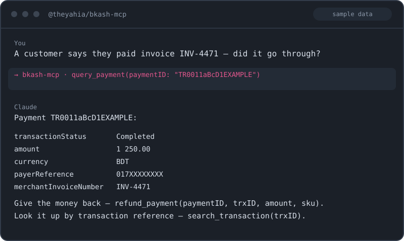

# bKash MCP server (Bangladesh) — 8 tools to connect Tokenized Checkout to Claude or any AI agent

If you were looking for how to connect bKash to Claude or another AI agent — this server gives the agent Tokenized Checkout end to end: create a payment, execute it once the customer confirms in the bKash app, check a status, refund in full or in part, look a transaction up by trxID, and set up recurring agreements. You ask "the customer says they paid invoice 4471 — did it go through?" and get the status and the amount without opening the merchant panel. The 3-step token grant and the token refresh sit inside the server; you supply the app key, app secret and merchant credentials once.

[](https://www.npmjs.com/package/@theyahia/bkash-mcp)
[](https://opensource.org/licenses/MIT)



---

## Tools (8)

### Payments

| Tool | Description |
|------|-------------|
| `create_payment` | Create a tokenized payment. Returns paymentID + customer redirect URL. |
| `execute_payment` | Finalize the payment after customer completes the bKash popup. |
| `query_payment` | Get status of a payment by paymentID. |
| `search_transaction` | Look up a transaction by trxID. |

### Refunds

| Tool | Description |
|------|-------------|
| `refund_payment` | Refund a payment (full or partial). |
| `query_refund` | Check the status of a previously requested refund. |

### Agreements (recurring billing)

| Tool | Description |
|------|-------------|
| `agreement_create` | Create a tokenized agreement for recurring billing — returns customer consent URL. |
| `agreement_query` | Query an existing agreement by agreementID. |

---

## Quick Start

### Claude Desktop

Add to `claude_desktop_config.json`:

```json
{
  "mcpServers": {
    "bkash": {
      "command": "npx",
      "args": ["-y", "@theyahia/bkash-mcp"],
      "env": {
        "BKASH_APP_KEY": "your_app_key",
        "BKASH_APP_SECRET": "your_app_secret",
        "BKASH_USERNAME": "your_merchant_username",
        "BKASH_PASSWORD": "your_merchant_password",
        "BKASH_SANDBOX": "true"
      }
    }
  }
}
```

Set `BKASH_SANDBOX=true` for sandbox testing; remove or set to `false` for production.

### Cursor / Windsurf

Same configuration block under `mcpServers`.

### VS Code (Copilot)

Add to `.vscode/mcp.json`:

```json
{
  "servers": {
    "bkash": {
      "command": "npx",
      "args": ["-y", "@theyahia/bkash-mcp"],
      "env": {
        "BKASH_APP_KEY": "...",
        "BKASH_APP_SECRET": "...",
        "BKASH_USERNAME": "...",
        "BKASH_PASSWORD": "...",
        "BKASH_SANDBOX": "true"
      }
    }
  }
}
```

### Streamable HTTP transport

```bash
HTTP_PORT=3000 \
BKASH_APP_KEY=... BKASH_APP_SECRET=... BKASH_USERNAME=... BKASH_PASSWORD=... \
npx @theyahia/bkash-mcp
```

Endpoints:
- `POST /mcp` — MCP requests
- `GET /mcp` — SSE event stream (per session)
- `DELETE /mcp` — session termination
- `GET /health` — `{ status: "ok", version, tools, uptime, memory_mb }`

---

## Environment Variables

| Variable | Required | Description |
|----------|----------|-------------|
| `BKASH_APP_KEY` | yes | Application key from bKash merchant panel. |
| `BKASH_APP_SECRET` | yes | Application secret. |
| `BKASH_USERNAME` | yes | Merchant username. |
| `BKASH_PASSWORD` | yes | Merchant password. |
| `BKASH_SANDBOX` | no | Set to `"true"` to use sandbox endpoint. |
| `HTTP_PORT` | no | If set, server runs in HTTP mode on this port. |

---

## Authentication

bKash uses a 3-step token grant flow, handled internally by this server:

1. **Grant Token**: server POSTs `app_key` + `app_secret` (body) and `username` + `password` (headers) to `/tokenized/checkout/token/grant` to receive `id_token` + `refresh_token`.
2. **API calls**: `id_token` is sent in the `Authorization` header (raw, no `Bearer` prefix) along with `X-APP-Key`.
3. **Refresh**: on HTTP 401, the server tries `/tokenized/checkout/token/refresh` with the cached `refresh_token`. On failure, it falls back to a fresh grant.

Get credentials at [developer.bka.sh](https://developer.bka.sh) (sandbox is free).

---

## Demo Prompts

Try these natural-language prompts in your MCP client:

> "Create a bKash payment for 500 BDT, invoice INV-2026-001, customer phone 01711XXXXXXX, redirect to https://mystore.com/bkash/callback."

> "Execute payment ABC123 — the customer just completed the popup."

> "Query payment ABC123 — what's the status?"

> "Search transaction TX9XYZ — give me the details."

> "Refund payment ABC123 (trxID TX9XYZ) for 200 BDT, sku REFUND-001, reason 'Customer changed mind'."

> "Create a recurring billing agreement for customer 01711XXXXXXX, callback URL https://mystore.com/bkash/agreement."

> "Query agreement AGR123 — is it still active?"

---

## Development

```bash
pnpm install
pnpm --filter @theyahia/bkash-mcp build
pnpm --filter @theyahia/bkash-mcp test
pnpm --filter @theyahia/bkash-mcp dev   # tsx watch mode
```

Project layout:

```
servers/bkash/
├── src/
│   ├── index.ts          — bin entry, runServer
│   ├── server.ts         — createServer factory + 8 tools (inline definitions)
│   └── client.ts         — BkashAuthStrategy (3-step grant flow) + bkashPost wrapper
└── tests/
    ├── client.test.ts    — grant token + auth headers + sandbox/prod URL switching + error paths
    └── server.test.ts    — createServer factory smoke
```

---

## License

MIT — see [LICENSE](./LICENSE).

---

Часть монорепозитория [WWmcp](https://github.com/theYahia/WWmcp) · Telegram: [@vhodvai](https://t.me/vhodvai)
