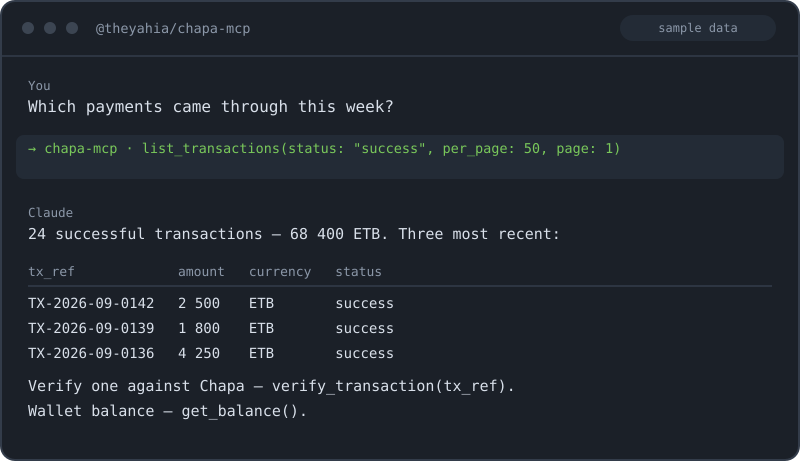

# @theyahia/chapa-mcp

> MCP server for **Chapa** (Ethiopia) — payment initialization, verification, transfers, banks, balance.
> 8 tools. Bearer auth. Stdio + Streamable HTTP transports.

[](https://www.npmjs.com/package/@theyahia/chapa-mcp)
[](https://opensource.org/licenses/MIT)



---

## Tools (8)

### Payments

| Tool | Description |
|------|-------------|
| `initialize_transaction` | Start a Chapa payment. Returns a checkout URL for the customer. |
| `verify_transaction` | Verify by `tx_ref` — returns status, amount, customer info, payment method. |
| `list_transactions` | List recent transactions with pagination + status filter. |

### Transfers (payouts)

| Tool | Description |
|------|-------------|
| `list_banks` | List supported Ethiopian banks (need bank_code for transfer). |
| `transfer` | Initiate a payout to a bank account. |
| `verify_transfer` | Check transfer status by reference. |
| `list_transfers` | List recent transfers. |

### Account

| Tool | Description |
|------|-------------|
| `get_balance` | Get current wallet balance (ETB and other supported currencies). |

---

## Quick Start

### Claude Desktop

Add to `claude_desktop_config.json`:

```json
{
  "mcpServers": {
    "chapa": {
      "command": "npx",
      "args": ["-y", "@theyahia/chapa-mcp"],
      "env": {
        "CHAPA_SECRET_KEY": "CHASECK_TEST-XXXXXXXX"
      }
    }
  }
}
```

For testing use a `CHASECK_TEST-...` key; for production use a `CHASECK-...` key.

### Cursor / Windsurf

Same configuration block under `mcpServers`.

### VS Code (Copilot)

Add to `.vscode/mcp.json`:

```json
{
  "servers": {
    "chapa": {
      "command": "npx",
      "args": ["-y", "@theyahia/chapa-mcp"],
      "env": { "CHAPA_SECRET_KEY": "your_key" }
    }
  }
}
```

### Streamable HTTP transport

```bash
HTTP_PORT=3000 CHAPA_SECRET_KEY=your_key npx @theyahia/chapa-mcp
```

Endpoints:
- `POST /mcp` — MCP requests
- `GET /mcp` — SSE event stream (per session)
- `DELETE /mcp` — session termination
- `GET /health` — `{ status: "ok", version, tools, uptime, memory_mb }`

---

## Environment Variables

| Variable | Required | Description |
|----------|----------|-------------|
| `CHAPA_SECRET_KEY` | yes | Bearer secret key. Test: `CHASECK_TEST-...`, live: `CHASECK-...`. |
| `HTTP_PORT` | no | If set, server runs in HTTP mode on this port. |

---

## Authentication

1. Sign up at [dashboard.chapa.co](https://dashboard.chapa.co/).
2. Go to **Settings → API Keys** and copy the secret key.
3. Use a `CHASECK_TEST-...` key during development; switch to `CHASECK-...` for production.
4. The same code path works for both — only the env value changes.

Docs: [developer.chapa.co](https://developer.chapa.co/)

---

## Demo Prompts

Try these natural-language prompts in your MCP client:

> "Initialize a Chapa transaction for 250 ETB, customer test@example.com, first name Abel, last name Bekele, tx_ref ORDER-001, redirect to https://mystore.com/thanks."

> "Verify transaction ORDER-001 — what's the status?"

> "List Ethiopian banks — I need bank codes for ETB transfers."

> "Transfer 1000 ETB to account 1000287654321 (account name 'Awash Bank Customer'), bank_code AWSCT, reference PAYOUT-001."

> "What's my Chapa wallet balance right now?"

> "Show me the last 50 successful transactions."

> "List transfers from this week."

---

## Development

```bash
pnpm install
pnpm --filter @theyahia/chapa-mcp build
pnpm --filter @theyahia/chapa-mcp test
pnpm --filter @theyahia/chapa-mcp dev   # tsx watch mode
```

Project layout:

```
servers/chapa/
├── src/
│   ├── index.ts          — bin entry, runServer
│   ├── server.ts         — createServer factory + 8 tools
│   └── client.ts         — BaseHttpClient + ApiKeyStrategy + chapaGet/chapaPost
└── tests/
    ├── client.test.ts    — auth headers + body shape + missing-key error
    └── server.test.ts    — createServer factory smoke
```

---

## License

MIT — see [LICENSE](./LICENSE).

---

Часть монорепозитория [WWmcp](https://github.com/theYahia/WWmcp) · Telegram: [@vhodvai](https://t.me/vhodvai)
