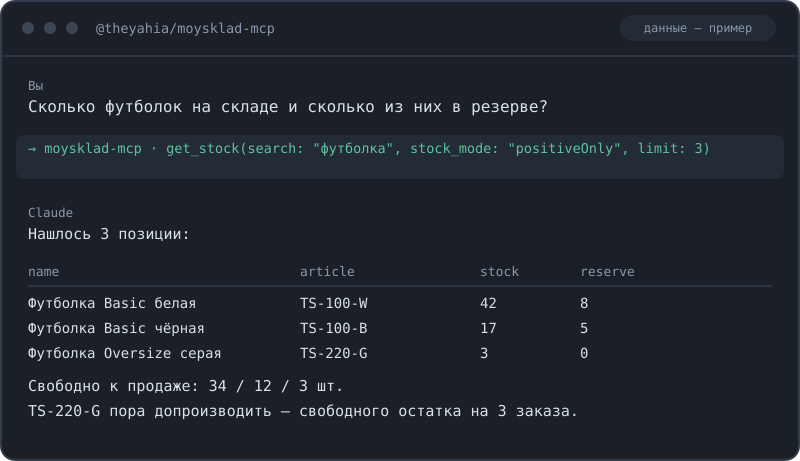

# MCP-сервер для МойСклад — 60 инструментов для ИИ-агента: склад, документы, деньги, отчёты

Если вы искали, как подключить МойСклад к Claude или другому ИИ-агенту, — этот сервер даёт агенту доступ ко всему учёту: сколько товара осталось и сколько из него в резерве, поиск позиции по артикулу, смена цены, заказ покупателя и отгрузка по нему, приёмка от поставщика, перемещение между складами, оприходование, списание и инвентаризация, счета и платежи, прибыль, обороты и остатки денег за период. Спрашиваете «сколько футболок свободно к продаже» — получаете таблицу с остатками и резервами, а не выгрузку в Excel. Цены во всех инструментах в рублях (перевод в копейки, которых требует API МойСклад, сервер делает сам), лимит запросов соблюдается автоматически — включая отчёты по остаткам, которые МойСклад тарифицирует впятеро дороже обычного запроса.

[](https://www.npmjs.com/package/@theyahia/moysklad-mcp)
[](https://www.npmjs.com/package/@theyahia/moysklad-mcp)
[](https://opensource.org/licenses/MIT)



## Установка

### Claude Desktop

`claude_desktop_config.json` — macOS: `~/Library/Application Support/Claude/`, Windows: `%APPDATA%\Claude\`.

```json
{
  "mcpServers": {
    "moysklad": {
      "command": "npx",
      "args": ["-y", "@theyahia/moysklad-mcp"],
      "env": {
        "MOYSKLAD_TOKEN": "your-api-token"
      }
    }
  }
}
```

Вместо токена можно передать логин и пароль:

```json
"env": {
  "MOYSKLAD_LOGIN": "user@company",
  "MOYSKLAD_PASSWORD": "your-password"
}
```

### Claude Code

```bash
claude mcp add moysklad \
  -e MOYSKLAD_TOKEN=your-api-token \
  -- npx -y @theyahia/moysklad-mcp
```

### VS Code / Cursor

```json
{
  "servers": {
    "moysklad": {
      "command": "npx",
      "args": ["-y", "@theyahia/moysklad-mcp"],
      "env": {
        "MOYSKLAD_TOKEN": "your-api-token"
      }
    }
  }
}
```

Требуется Node.js 18 или новее.

## Инструменты

60 инструментов в 16 модулях. Все цены и суммы — в рублях: перевод в копейки, которых
требует API МойСклад, сервер делает сам (исключение — `get_dashboard`, он отдаёт суммы
в копейках, как их возвращает МойСклад).

### Товары, услуги и каталог — 10

| Инструмент | Что делает |
|---|---|
| `search_products` | Поиск товаров по названию или артикулу. Постраничный список с ценами продажи и закупки в рублях, до 1000 записей на страницу. `filter_article` — точное совпадение по SKU |
| `get_product` | Товар по UUID целиком: название, артикул, код, описание, все цены продажи с типами цен, цена закупки, вес, объём, время последнего изменения. `raw: true` — сырой объект МойСклада |
| `create_product` | Создаёт товар: название, артикул, описание, код, цены в рублях, вес в граммах, объём в литрах, ставка НДС. Цена продажи привязывается к типу цены по умолчанию либо к переданному `price_type_href` |
| `update_prices` | Меняет цену продажи, закупки или минимальную цену у товара по UUID. Существующий тип цены сохраняется; если его нет — подставляется тип по умолчанию |
| `search_assortment` | Единый поиск по товарам, модификациям, услугам и комплектам сразу. Возвращает тип позиции, цену и meta-href |
| `search_variants` | Поиск модификаций товаров |
| `search_bundles` | Поиск комплектов (наборов) |
| `search_services` | Поиск услуг |
| `create_service` | Создаёт услугу с ценой в рублях и ставкой НДС |
| `list_price_types` | Типы цен аккаунта; первый в списке — тип по умолчанию. Отсюда берётся `price_type_href` |

### Остатки — 3

| Инструмент | Что делает |
|---|---|
| `get_stock` | Отчёт по остаткам: количество, резерв и ожидание по каждой позиции. Группировка по товару, модификации или складу; фильтр по уровню остатка (положительный, отрицательный, нулевой, ненулевой) |
| `get_stock_by_store` | Остатки в разрезе складов: сколько каждой позиции лежит на каждом складе |
| `get_stock_current` | Быстрый текущий остаток (без пагинации), опционально по одному складу |

### Контрагенты — 3

| Инструмент | Что делает |
|---|---|
| `get_counterparties` | Поиск контрагентов — покупателей и поставщиков — по названию, ИНН или телефону. Возвращает id, название, телефон, email, ИНН и тип компании |
| `get_counterparty` | Контрагент по UUID. `raw: true` — сырой объект МойСклада |
| `create_counterparty` | Создаёт контрагента: название, ИНН, телефон, email, тип (`legal` / `entrepreneur` / `individual`) |

### Заказы покупателей и отгрузки — 5

| Инструмент | Что делает |
|---|---|
| `create_customer_order` | Создаёт заказ покупателя. Нужны meta-ссылки организации и контрагента и хотя бы одна позиция с товаром и количеством. Поддерживает скидку по позиции |
| `get_orders` | Заказы покупателей с поиском по названию или номеру, фильтром по статусу и контрагенту, сортировкой по дате создания, дате документа или сумме |
| `get_customer_order` | Один заказ по UUID с развёрнутыми позициями |
| `update_customer_order_status` | Меняет статус заказа. Список статусов — `get_metadata` для `customerorder` |
| `create_demand` | Оформляет отгрузку со склада, опционально привязанную к заказу покупателя |

### Складские документы — 13

| Инструмент | Что делает |
|---|---|
| `create_supply` | Приёмка товара от поставщика на склад. Опционально входящий номер и дата |
| `create_move` | Перемещение между двумя складами |
| `get_moves` | Список перемещений |
| `create_enter` | Оприходование — постановка товара на склад |
| `get_enters` | Список оприходований |
| `create_loss` | Списание товара со склада |
| `get_losses` | Список списаний |
| `create_inventory` | Инвентаризация склада. Позиции можно передать сразу или заполнить позже |
| `get_inventories` | Список инвентаризаций |
| `create_purchase_order` | Заказ поставщику |
| `get_purchase_orders` | Список заказов поставщикам |
| `create_sales_return` | Возврат от покупателя |
| `create_purchase_return` | Возврат поставщику |

### Деньги и счета — 7

| Инструмент | Что делает |
|---|---|
| `create_payment_in` | Входящий банковский платёж |
| `create_payment_out` | Исходящий банковский платёж. При необходимости — статья расходов `expense_item_href` |
| `create_cash_in` | Приходный кассовый ордер |
| `create_cash_out` | Расходный кассовый ордер |
| `create_invoice_out` | Счёт покупателю с позициями |
| `create_invoice_in` | Счёт поставщика с позициями |
| `get_invoices_out` | Список счетов покупателям |

### Отчёты — 5

| Инструмент | Что делает |
|---|---|
| `get_profit_report` | Прибыль по товарам: продано штук и на сумму, себестоимость, возвраты, прибыль и маржа. Период — `moment_from` / `moment_to` в ISO 8601 |
| `get_sales_report` | Продажи по товарам: количество и выручка за период |
| `get_dashboard` | Показатели за день, неделю или месяц. Суммы в копейках, как их отдаёт МойСклад |
| `get_turnover` | Обороты товаров за период: остаток на начало, приход, расход, остаток на конец |
| `get_money_report` | Остатки денег по расчётным счетам и кассам |

### Справочники и метаданные — 6

| Инструмент | Что делает |
|---|---|
| `list_organizations` | Ваши юрлица с ИНН и meta-href — нужны для любого документа |
| `list_stores` | Склады с адресами и meta-href |
| `list_employees` | Сотрудники — владельцы и ответственные по документам |
| `list_currencies` | Валюты с ISO-кодами и курсами |
| `list_product_folders` | Товарные группы с полным путём |
| `get_metadata` | Метаданные типа сущности: статусы, доп. поля, типы цен. Отсюда берутся meta-href статусов заказа |

### Универсальный доступ к документам — 2

| Инструмент | Что делает |
|---|---|
| `get_documents` | Список документов любого типа сущности МойСклада (`entity_type`) — запасной вариант для того, чему нет отдельного инструмента |
| `get_document` | Один документ любого типа по UUID с развёрнутыми позициями |

### Вебхуки — 4

| Инструмент | Что делает |
|---|---|
| `list_webhooks` | Зарегистрированные вебхуки: URL, событие, тип сущности, статус |
| `create_webhook` | Регистрирует вебхук на событие `CREATE` / `UPDATE` / `DELETE` / `PROCESSED` |
| `update_webhook` | Меняет URL, событие, тип сущности или включённость вебхука |
| `delete_webhook` | Удаляет вебхук по UUID |

### Аудит — 2

| Инструмент | Что делает |
|---|---|
| `get_audit` | Журнал событий аккаунта: кто, что и когда изменил, с фильтром по датам |
| `get_entity_audit` | История изменений одной сущности по типу и UUID |

## Примеры запросов

- «Каких товаров осталось меньше пяти штук на основном складе — покажи с артикулами».
- «Найди контрагента по ИНН 7707083893 и посмотри его заказы за последний квартал».
- «Посчитай прибыль и маржу по товарам за июнь — какие пять позиций принесли больше всего».
- «Перемести 10 штук LP15 с основного склада в розницу и покажи номер документа».
- «Начни инвентаризацию склада „Основной“ и покажи текущие остатки, с чем сверять».
- «Сколько денег на счетах и в кассах прямо сейчас».

## Переменные окружения

Авторизация двойная: либо токен, либо пара логин + пароль.

| Переменная | Обязательна | Где взять |
|---|---|---|
| `MOYSKLAD_TOKEN` | да, если не заданы логин и пароль | Токен доступа к API МойСклад |
| `MOYSKLAD_LOGIN` | да, если не задан токен | Логин пользователя МойСклад |
| `MOYSKLAD_PASSWORD` | да, если не задан токен | Пароль того же пользователя |

Токен имеет приоритет: если он задан, логин и пароль не используются.

## Транспорт

По умолчанию сервер работает через stdio — этого достаточно для Claude Desktop, Claude Code, VS Code и Cursor.

Для запуска по HTTP (Streamable HTTP, эндпоинт `/mcp` плюс `/health` со статусом и числом инструментов) передайте флаг `--http` или задайте `HTTP_PORT`:

```bash
HTTP_PORT=3000 npx -y @theyahia/moysklad-mcp
```

---

Часть монорепозитория [WWmcp](https://github.com/theYahia/WWmcp) · Telegram: [@vhodvai](https://t.me/vhodvai)
