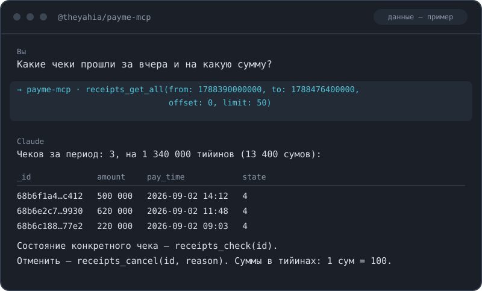

# MCP-сервер для Payme (Узбекистан) — карты, чеки и приём платежей (10 инструментов)

Позволяет из диалога с ассистентом токенизировать карту UzCard или Humo, подтвердить её кодом из SMS, выставить чек, оплатить его или отправить клиенту ссылку на оплату, отменить чек и посмотреть историю за период. Работает с Payme Subscribe API по JSON-RPC 2.0; по умолчанию сервер стартует в песочнице, боевой контур включается отдельной переменной.

[](https://www.npmjs.com/package/@theyahia/payme-mcp)
[](https://www.npmjs.com/package/@theyahia/payme-mcp)
[](https://opensource.org/licenses/MIT)



## Установка

### Claude Desktop

`claude_desktop_config.json` — macOS: `~/Library/Application Support/Claude/`, Windows: `%APPDATA%\Claude\`.

```json
{
  "mcpServers": {
    "payme": {
      "command": "npx",
      "args": ["-y", "@theyahia/payme-mcp"],
      "env": {
        "PAYME_CASHBOX_ID": "your-cashbox-id",
        "PAYME_KEY": "your-cashbox-key",
        "PAYME_SANDBOX": "true"
      }
    }
  }
}
```

### Claude Code

```bash
claude mcp add payme \
  -e PAYME_CASHBOX_ID=your-cashbox-id \
  -e PAYME_KEY=your-cashbox-key \
  -e PAYME_SANDBOX=true \
  -- npx -y @theyahia/payme-mcp
```

### VS Code / Cursor

```json
{
  "servers": {
    "payme": {
      "command": "npx",
      "args": ["-y", "@theyahia/payme-mcp"],
      "env": {
        "PAYME_CASHBOX_ID": "your-cashbox-id",
        "PAYME_KEY": "your-cashbox-key",
        "PAYME_SANDBOX": "true"
      }
    }
  }
}
```

Требуется Node.js 18 или новее.

## Инструменты

### Карты

| Инструмент | Что делает |
|---|---|
| `cards_create` | Токенизирует карту: номер серии 8600 (UzCard) или 5614 (Humo) и срок в формате MMYY. Возвращает токен для остальных операций. В песочнице срок — 0399 |
| `cards_verify` | Подтверждает токен кодом из SMS на телефон держателя. Без этого шага картой нельзя платить. В песочнице код всегда 666666 |
| `cards_check` | Проверяет, действителен ли токен карты. Вызывать перед оплатой, чтобы не ловить ошибку на платеже |
| `cards_remove` | Удаляет токен карты. После удаления токен недействителен, операция необратима |

### Чеки

| Инструмент | Что делает |
|---|---|
| `receipts_create` | Создаёт чек. Сумма — в тийинах: 1 сум = 100 тийинов, то есть 100 000 тийинов = 1000 сумов. Поля счёта передаются объектом, например `{order_id: "123"}` |
| `receipts_pay` | Оплачивает чек подтверждённым токеном карты. Возвращает статус транзакции и таймстемпы |
| `receipts_send` | Отправляет ссылку на оплату по SMS. Телефон в международном формате, например 998901234567 |
| `receipts_cancel` | Отменяет чек по коду причины. Если чек уже оплачен, запускается возврат; причина отмены пишется в аудит |
| `receipts_check` | Текущее состояние чека: статус, сумма, время создания и оплаты, поля счёта |
| `receipts_get_all` | Чеки за период по таймстемпам в миллисекундах, с пагинацией через offset и limit |

## Примеры запросов

- «Выстави чек на 250 000 сумов по заказу 4417 и отправь ссылку на оплату на номер 998901234567».
- «Проверь чек 62f1a9c4... — оплачен он или ещё висит, и когда создан».
- «Покажи все чеки за прошлую неделю: сколько оплачено и на какую сумму в сумах».

## Переменные окружения

| Переменная | Обязательна | Где взять |
|---|---|---|
| `PAYME_CASHBOX_ID` | да | ID кассы в кабинете Payme Business |
| `PAYME_KEY` | да | Ключ той же кассы. Вместе с ID образует заголовок `X-Auth` |
| `PAYME_SANDBOX` | нет | Режим песочницы. По умолчанию включена; для боевого контура задайте строку `false` — любое другое значение оставит песочницу |

Песочница ходит на `checkout.test.paycom.uz`, боевой контур — на `checkout.paycom.uz`. Без `PAYME_CASHBOX_ID` или `PAYME_KEY` сервер не стартует.

## Транспорт

По умолчанию сервер работает через stdio — этого достаточно для Claude Desktop, Claude Code, VS Code и Cursor.

Для запуска по HTTP (Streamable HTTP, эндпоинт `/mcp` плюс `/health` со статусом и числом инструментов) передайте флаг `--http` или задайте `HTTP_PORT`:

```bash
HTTP_PORT=3000 npx -y @theyahia/payme-mcp
```

---

Часть монорепозитория [WWmcp](https://github.com/theYahia/WWmcp) · Telegram: [@vhodvai](https://t.me/vhodvai)
