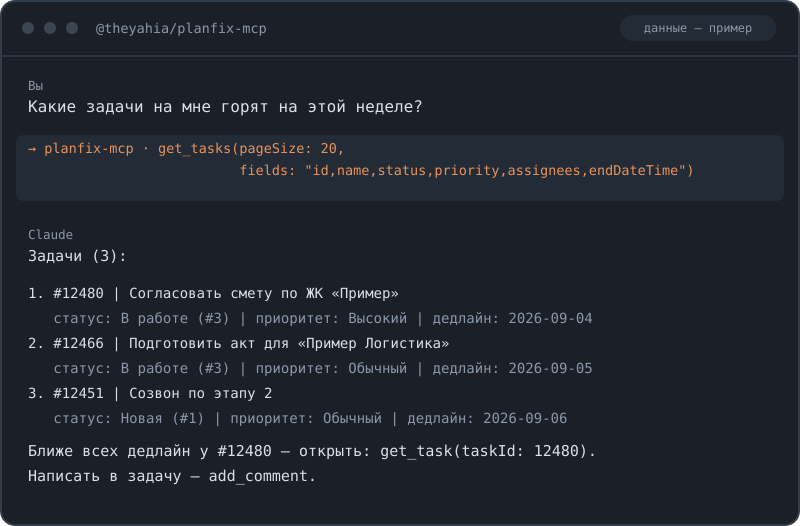

> 📦 Part of **[WWmcp — Emerging Markets MCP](https://github.com/theYahia/WWmcp)** — 46 MCP servers for non-Western APIs (Brazil/MENA/Gulf/SE Asia/Africa/CIS). · Telegram: [@vhodvai](https://t.me/vhodvai)

# @theyahia/planfix-mcp

MCP-сервер для Planfix API — задачи, проекты, контакты, комментарии, сотрудники, файлы. **20 инструментов, 2 навыка.**

[](https://www.npmjs.com/package/@theyahia/planfix-mcp)
[](https://opensource.org/licenses/MIT)



## Переезд в монорепозиторий WWmcp

Сервер переехал из `theYahia/planfix-mcp` в `theYahia/WWmcp` (`servers/planfix`) и
теперь построен на `@theyahia/mcp-core`:

- **HTTP-транспорт:** порт задаётся через `HTTP_PORT`, а не позиционным аргументом
  после `--http` (см. ниже). Появились `/health`, CORS, session management и
  graceful shutdown.
- **Ошибки инструментов** возвращаются как `CallToolResult` с `isError: true`
  (по спеке MCP) вместо исключения — модель может сама исправиться и повторить.

Имена инструментов, аргументы, формат ответов, MCP-навыки и переменные `PLANFIX_*`
не изменились.

## Установка

### Claude Desktop

```json
{
  "mcpServers": {
    "planfix": {
      "command": "npx",
      "args": ["-y", "@theyahia/planfix-mcp"],
      "env": {
        "PLANFIX_API_KEY": "your-api-key",
        "PLANFIX_ACCOUNT": "your-subdomain"
      }
    }
  }
}
```

### Claude Code

```bash
claude mcp add planfix \
  -e PLANFIX_API_KEY=your-api-key \
  -e PLANFIX_ACCOUNT=your-subdomain \
  -- npx -y @theyahia/planfix-mcp
```

### Streamable HTTP (удалённый сервер)

```bash
PLANFIX_API_KEY=your-key PLANFIX_ACCOUNT=your-sub HTTP_PORT=8080 npx @theyahia/planfix-mcp --http
```

Порт задаётся переменной `HTTP_PORT` (по умолчанию 3000). Флаг `--http` включает
HTTP-транспорт; позиционный аргумент порта больше не читается.

Эндпоинт: `http://localhost:8080/mcp`
Health check: `http://localhost:8080/health`

### Smithery

[](https://smithery.ai/server/@theyahia/planfix-mcp)

```bash
npx -y @smithery/cli install @theyahia/planfix-mcp --client claude
```

### VS Code / Cursor

```json
{
  "servers": {
    "planfix": {
      "command": "npx",
      "args": ["-y", "@theyahia/planfix-mcp"],
      "env": {
        "PLANFIX_API_KEY": "your-api-key",
        "PLANFIX_ACCOUNT": "your-subdomain"
      }
    }
  }
}
```

### Windsurf

```json
{
  "mcpServers": {
    "planfix": {
      "command": "npx",
      "args": ["-y", "@theyahia/planfix-mcp"],
      "env": {
        "PLANFIX_API_KEY": "your-api-key",
        "PLANFIX_ACCOUNT": "your-subdomain"
      }
    }
  }
}
```

## Авторизация

| Переменная | Обязательная | Описание |
|-----------|-------------|----------|
| `PLANFIX_API_KEY` | Да | API-ключ. Создаётся в Управлении аккаунтом → Доступ к API → REST API |
| `PLANFIX_ACCOUNT` | **Да** | Субдомен (например `mycompany` из `mycompany.planfix.com`). Обязателен — общего хоста у REST API нет |
| `PLANFIX_HOST` | Нет | Хост для региональных инсталляций (по умолчанию `planfix.com`; например `planfix.ru`) |
| `PLANFIX_TOKEN` | Нет | Устаревший вариант, используйте `PLANFIX_API_KEY` |

Base URL: `https://{PLANFIX_ACCOUNT}.{PLANFIX_HOST}/rest/`. Авторизация — заголовок `Authorization: Bearer <key>`.

## Инструменты (20)

### Задачи

| Инструмент | Описание |
|------------|----------|
| `get_tasks` | Список задач (пагинация, `fields`, `filterId`, ad-hoc `filters`) |
| `get_task` | Одна задача по ID |
| `create_task` | Создание задачи (можно указать проект, исполнителя — см. `list_users`) |
| `update_task` | Обновление задачи (название, описание, статус, исполнитель) |

### Контакты

| Инструмент | Описание |
|------------|----------|
| `get_contacts` | Список контактов |
| `get_contact` | Один контакт по ID |
| `create_contact` | Создать контакт или компанию |
| `update_contact` | Обновить контакт (имя, email, телефон) |

### Проекты, комментарии

| Инструмент | Описание |
|------------|----------|
| `get_projects` | Список проектов |
| `get_project` | Один проект по ID |
| `get_comments` | Комментарии к задаче |
| `add_comment` | Добавить комментарий к задаче |

### Сотрудники, справочники, поля, файлы

| Инструмент | Описание |
|------------|----------|
| `list_users` | Список сотрудников — **используйте для поиска ID исполнителя по имени** |
| `get_user` | Один сотрудник по ID |
| `list_directories` | Справочники (наборы статусов задач хранятся как справочники) |
| `list_directory_entries` | Записи справочника по его ID (например, варианты статусов) |
| `list_custom_fields` | Кастомные поля по типу объекта (`task`/`contact`/`project`/`user`/`main`) |
| `list_datatags` | Дата-теги |
| `upload_file_from_url` | Загрузить файл по прямой ссылке |
| `get_file` | Метаданные файла по ID |

## Навыки (Skills / Prompts) (2)

| Навык | Описание |
|-------|----------|
| `skill-my-tasks` | "Мои задачи на сегодня" — показывает задачи с дедлайном сегодня или просроченные |
| `skill-create-task` | "Создай задачу в проекте" — пошаговый помощник для создания задачи с выбором проекта |

## Статусы задач

Отдельного эндпоинта `/taskstatus/list` в Planfix нет. Системные статусы — фиксированный
набор констант: `DRAFT, ACTIVE, ACCEPTED, COMPLETED, DELAYED, REJECTED, DONE, CANCELED`.
Кастомные наборы статусов настраиваются как справочники — перечислить их можно через
`list_directories` → `list_directory_entries`.

## Примеры

```
Покажи мои задачи в Planfix
Найди сотрудника Иванов и создай задачу "Подготовить отчёт" в проекте 123 с ним как исполнителем
Список контактов
Покажи проекты
Добавь комментарий к задаче 456: "Готово"
```

## 🚀 Demo prompts

> **Use case (RU):** "Создай задачу 'Звонок клиенту' в Planfix, привяжи к сделке #12345"

🤖 **Pairs well with:**
- [`@theyahia/kaiten-mcp`](https://github.com/theYahia/kaiten-mcp)
- [`@theyahia/megaplan-mcp`](https://github.com/theYahia/WWmcp/tree/main/servers/megaplan)
- [`@theyahia/yandex-tracker-mcp`](https://github.com/theYahia/yandex-tracker-mcp)

## Ограничения

- **`priority` в `create_task`** передаётся как строка «как есть» — точные допустимые
  значения не верифицированы против live API.
- Прямая загрузка файлов с диска (multipart `POST /file/`) и эндпоинты
  time-tracking/actions не реализованы (REST-контракт не подтверждён). Доступна загрузка
  файла по ссылке (`upload_file_from_url`).

## Разработка

```bash
npm install
npm test        # Vitest (32 теста)
npm run dev     # tsx watch
npm run build   # TypeScript compile
```

## Planfix — реферальная программа

**35% бессрочный recurring** от всех платежей приведённых клиентов.

- Без сертификации — просто зарегистрируйтесь в партнёрской программе
- Recurring: получаете 35% каждый месяц, пока клиент платит
- Бессрочно: нет ограничений по времени выплат

Подробнее: [planfix.com/partners](https://planfix.com/ru/partner-program/)

## Лицензия

MIT

---

⭐ **Star if you build with Planfix** — helps other devs find this server.
